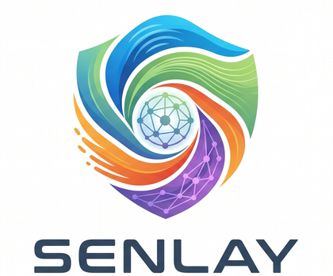

<p align="center">
  
</p>

# Senlay World

Public website, product narrative, and developer-facing documentation for **Senlay**, the sensory intelligence layer for AI agents.

Senlay gives software a live view of the physical world: wind, weather, ocean state, terrain, air quality, seismic activity, and other external signals. The public site explains the product, the founder story, the API surface, and the agent use cases. The production backend lives in a separate private repository.

[senlay.world](https://senlay.world) · [API Docs](public/docs.html) · [Founder Story](public/founder.html) · [Support](public/support.html)

## Why Senlay Exists

AI systems are strong at language and reasoning, but they are often blind to the physical conditions around a person, vehicle, job site, coastline, or device. Senlay closes that gap by converting real-world sensor data into context that an AI agent can understand and act on.

The long-term goal is simple: make AI useful when reality matters.

## What This Repository Contains

This repository contains the public presentation layer:

- product landing page
- founder biography and selected story assets
- public API documentation pages
- agent and Moltbook onboarding pages
- support, pricing, and roadmap pages
- brand assets, styles, and front-end scripts
- GitHub Pages deployment workflow for the static site

It does **not** contain production secrets, live databases, API keys, server logs, or backend deployment state.

## Repository Structure

```text
senlay-world/
  .github/workflows/     GitHub Pages workflow
  docs/                  Product and repository notes
  public/                Deployable static website root
    assets/brand/        Logos and icons
    assets/founder-selected/
                          Curated public founder/story images
    scripts/             Front-end JavaScript
    styles/              Shared CSS
    *.html               Public pages served at site root
  README.md
  LICENSE
  SECURITY.md
  CONTRIBUTING.md
```

The static site is intentionally kept under `public/` so the root of the repository stays readable for investors, developers, partners, and future collaborators.

## For Developers

To preview the static site locally:

```bash
cd public
python3 -m http.server 8080
```

Then open:

```text
http://127.0.0.1:8080
```

Some pages call the live Senlay API. Those calls require the private platform backend to be running in production.

## Related Repositories

- `smartsurfsolar/senlay-world` - public website and product documentation.
- `smartsurfsolar/senlay-platform` - private backend platform, API server, sensor fusion logic, deployment templates, and operational code.

## Status

Senlay is an active product. Public content in this repository should be treated as product-facing material, not as a scratchpad. For raw experiments, drafts, backups, and internal notes, use private storage or the private platform repository.

## Contact

- Email: [smartsurfsolar@gmail.com](mailto:smartsurfsolar@gmail.com)
- WhatsApp: [+84 3333 801 68](https://wa.me/84333380168)
- LinkedIn: [Viktor Kryvotsiuk](https://www.linkedin.com/in/viktor-kryvotsiuk-0b7449151/)
- Ko-fi: [ko-fi.com/senlay](https://ko-fi.com/senlay)

## Ownership

Copyright 2026 Senlay / SmartSurf Solar. All rights reserved.
